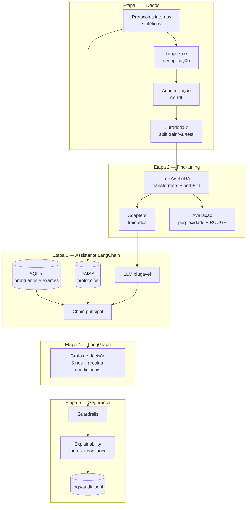
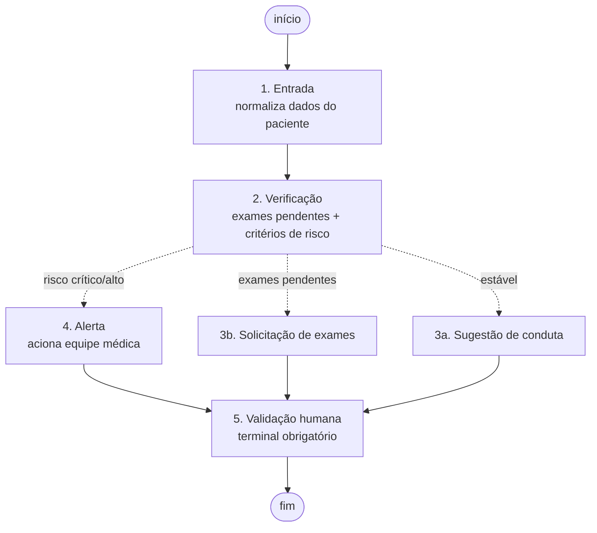

# Assistente Virtual Médico — Fine-tuning de LLM + LangChain + LangGraph

Tech Challenge — Fase 3 (FIAP 9IADT).

Assistente virtual de apoio à decisão clínica treinado com dados de um
hospital, capaz de auxiliar em condutas, responder dúvidas de profissionais de
saúde e sugerir procedimentos com base em protocolos internos, com fluxos de
decisão automatizados e seguros coordenados por LangChain e LangGraph.

> ⚠️ **Projeto acadêmico.** Todos os dados (pacientes, prontuários,
> protocolos) são **sintéticos**. Os protocolos clínicos foram escritos para
> fins didáticos e **não constituem orientação médica real**. O assistente
> não prescreve e toda saída exige validação humana.

---

## Índice

- [Arquitetura](#arquitetura)
- [Requisitos](#requisitos)
- [Instalação](#instalação)
- [Como executar](#como-executar)
- [Fine-tuning](#fine-tuning)
- [Estrutura do repositório](#estrutura-do-repositório)
- [Segurança e auditoria](#segurança-e-auditoria)
- [Testes](#testes)
- [Avaliação](#avaliação)
- [Limitações conhecidas](#limitações-conhecidas)

---

## Arquitetura



O **fluxo de decisão clínica** (Etapa 4):



Detalhes de cada camada nos READMEs de módulo:
[`preprocessing/`](preprocessing/README.md) ·
[`finetuning/`](finetuning/README.md) ·
[`assistant/`](assistant/README.md) ·
[`graphs/`](graphs/README.md) ·
[`security/`](security/README.md)

---

## Requisitos

- **Python 3.11+**
- **Para rodar o assistente:** nenhuma GPU. As dependências de execução são
  leves (LangChain, LangGraph, FAISS, scikit-learn).
- **Para o fine-tuning:** GPU **NVIDIA** com pelo menos ~8 GB de VRAM (a T4
  do Colab gratuito atende) e acesso à Hugging Face Hub. Runtime **TPU não
  funciona** — o QLoRA depende do `bitsandbytes`, que só tem kernels CUDA/ROCm.

---

## Instalação

```bash
git clone https://github.com/RenanAmaral/FIAP-9IADT-medical-agent-fine-tuned.git
cd FIAP-9IADT-medical-agent-fine-tuned

python -m venv .venv
source .venv/bin/activate        # Windows: .venv\Scripts\activate

pip install -r requirements.txt
```

Para rodar **apenas o assistente**, sem o fine-tuning, as dependências pesadas
(`torch`, `transformers`, `peft`, `trl`, `bitsandbytes`) não são necessárias:

```bash
pip install faker pandas scikit-learn pytest langchain langchain-community langgraph faiss-cpu
```

---

## Como executar

### 1. Gerar os dados (Etapa 1)

```bash
python -m preprocessing.run_pipeline
```

Gera o dataset sintético, limpa, anonimiza e divide em train/val/test.
Saída em `data/` e relatório de curadoria em
`data/processed/curation_report.md`.

### 2. Criar a base estruturada (Etapa 3)

```bash
python -m assistant.database
```

Cria `assistant/hospital.db` com 5 pacientes sintéticos, seus exames e
evoluções.

### 3. Consultar o assistente

```bash
# Listar pacientes disponíveis
python -m assistant.cli --listar-pacientes

# Pergunta geral, sem paciente
python -m assistant.cli --pergunta "Qual escore avalia gravidade em pneumonia?"

# Pergunta contextualizada em um paciente
python -m assistant.cli --paciente PAC-0002 --pergunta "Posso ajustar o tratamento?"

# Modo interativo
python -m assistant.cli --interativo --paciente PAC-0001
```

### 4. Executar o fluxo clínico automatizado (Etapa 4)

```bash
# Demonstra os três caminhos do grafo em sequência
python -m graphs.cli --demo

# Um caso específico
python -m graphs.cli --paciente PAC-0003 --pergunta "Qual a conduta?"
```

Casos de demonstração:

| Paciente | Situação | Caminho no grafo |
|---|---|---|
| `PAC-0001` | Hipertenso estável | `entrada → verificacao → sugestao → validacao_humana` |
| `PAC-0002` | Diabético com HbA1c pendente | `entrada → verificacao → solicitacao_exames → validacao_humana` |
| `PAC-0003` | Pneumonia evoluindo com sepse | `entrada → verificacao → alerta → validacao_humana` |
| `PAC-0004` | Gestante com TOTG pendente | `entrada → verificacao → solicitacao_exames → validacao_humana` |
| `PAC-0005` | Lombalgia sem red flags | `entrada → verificacao → sugestao → validacao_humana` |

### 5. Auditar as interações (Etapa 5)

```bash
python -m security.inspect_logs              # resumo
python -m security.inspect_logs --bloqueios  # interações bloqueadas
python -m security.inspect_logs --alertas    # fluxos com alerta
python -m security.inspect_logs --detalhe -n 3
```

---

## Fine-tuning

O treino exige GPU e acesso à Hugging Face Hub, então roda no **Google Colab
ou Kaggle** — há um notebook pronto em
`finetuning/notebooks/colab_finetune.ipynb`.

**Antes: configure um token da Hugging Face.** Sem ele os downloads são
anônimos e compartilham o limite de taxa do IP do Colab, ficando mais lentos e
podendo falhar com HTTP 429 no meio dos 2 GB de pesos. Crie um token de
leitura em https://huggingface.co/settings/tokens e adicione-o como secret
`HF_TOKEN` no Colab (🔑, com *Notebook access* ativo), ou
`export HF_TOKEN=hf_xxx` localmente. Os scripts o detectam automaticamente.

```bash
# Treinar (LoRA/QLoRA)
python -m finetuning.train --base-model TinyLlama/TinyLlama-1.1B-Chat-v1.0

# Avaliar (perplexidade, ROUGE, comparação antes/depois)
python -m finetuning.evaluate \
    --base-model TinyLlama/TinyLlama-1.1B-Chat-v1.0 \
    --adapter-dir finetuning/adapters/medical-assistant-lora \
    --test-file data/processed/test.jsonl
```

Depois de treinar, basta trocar o backend para usar o modelo no assistente —
nem a chain nem o grafo mudam:

```bash
python -m graphs.cli --backend finetuned --paciente PAC-0003 --pergunta "Qual a conduta?"
```

Ver [`finetuning/README.md`](finetuning/README.md) para hiperparâmetros e o
passo a passo completo.

### Backends de LLM

| Backend | O que é | Quando usar |
|---|---|---|
| `finetuned` | Modelo base + adapters LoRA da Etapa 2. | Produção e demonstração final. |
| `base` | Modelo base sem fine-tuning. | Comparação antes/depois. |
| `template` | **Não é um modelo.** Stub determinístico que remonta a resposta a partir do contexto recuperado. | Desenvolvimento e testes offline (padrão). |

O `template` existe porque o ambiente em que este projeto foi desenvolvido não
tem GPU nem acesso à Hugging Face Hub: ele permite exercitar e testar toda a
orquestração (RAG, base estruturada, grafo, guardrails, logging) sem o modelo.
Não deve ser usado na demonstração final.

---

## Estrutura do repositório

```
.
├── data/               # dataset sintético e anonimizado (Etapa 1)
│   ├── raw/            # saída bruta da geração
│   ├── protocols/      # protocolos internos em Markdown (fonte do RAG)
│   └── processed/      # splits, relatório de curadoria e manifesto
├── preprocessing/      # limpeza, anonimização e curadoria (Etapa 1)
├── finetuning/         # scripts de treino LoRA/QLoRA e avaliação (Etapa 2)
│   └── notebooks/      # notebook Colab
├── assistant/          # chains, prompts, RAG, base estruturada (Etapa 3)
├── graphs/             # fluxo de decisão LangGraph (Etapa 4)
├── security/           # guardrails e auditoria (Etapa 5)
├── logs/               # registros de auditoria em JSONL (runtime)
├── docs/               # relatório técnico e diagramas
├── tests/              # suíte de testes (pytest)
├── requirements.txt
└── README.md
```

---

## Segurança e auditoria

O assistente opera sob três garantias, todas verificadas por testes:

1. **Nunca prescreve.** Pedidos de prescrição direta são bloqueados na
   entrada, e posologia imperativa é bloqueada na saída — por validação
   programática, não apenas por instrução no prompt.
2. **Sempre exige validação humana.** Toda resposta liberada carrega o aviso,
   e o grafo termina obrigatoriamente no nó de validação humana.
3. **Sempre cita as fontes.** Cada resposta indica os protocolos e registros
   que a embasaram, com um grau de confiança de recuperação — explicitamente
   distinto de correção clínica.

Cada interação é registrada em `logs/audit.jsonl` com timestamp, sessão,
pergunta, contexto recuperado, resposta, nós do grafo executados e bloqueios
acionados. Ver [`security/README.md`](security/README.md).

---

## Testes

```bash
pytest -q                        # suíte completa
pytest tests/test_graph.py -q    # só o grafo
```

**100 testes** cobrindo anonimização, curadoria, contrato de prompt, base
estruturada, recuperação (RAG), guardrails, explainability, os três caminhos
do grafo, o schema do log de auditoria e a compatibilidade entre versões de
`trl`/`transformers`.

---

## Avaliação

### Recuperação (RAG)

```bash
python -m assistant.evaluate_rag
```

Benchmark de 15 perguntas clínicas com o protocolo correto anotado
manualmente:

| Métrica | Resultado |
|---|---|
| Acurácia top-1 | **93,3%** |
| Recall@3 | **100%** |

O teste `test_retrieval_benchmark_meets_quality_bar` trava esses patamares,
então uma regressão na recuperação quebra o build.

### Modelo

`python -m finetuning.evaluate` produz perplexidade, ROUGE-1/ROUGE-L e uma
comparação qualitativa lado a lado (base vs. fine-tuned) em
`finetuning/eval_results/`. Requer os adapters treinados.

---

## Limitações conhecidas

- **O fine-tuning não foi executado neste repositório.** O ambiente de
  desenvolvimento não tem GPU nem acesso à Hugging Face Hub. O código de
  treino e avaliação está completo e pronto para rodar no Colab/Kaggle, mas
  as métricas do modelo em `docs/relatorio_tecnico.md` só ficam preenchidas
  após essa execução.
- **Embeddings TF-IDF por padrão.** Determinísticos e offline, adequados para
  o corpus pequeno e de vocabulário técnico deste projeto. Em produção,
  embeddings densos (`load_huggingface_embeddings()`) capturariam
  similaridade semântica além da lexical.
- **Dados sintéticos.** Os protocolos foram escritos para o exercício e não
  refletem diretrizes clínicas reais; os limiares de risco replicam apenas
  esses protocolos.
- **Detecção de risco por regex.** Funciona bem sobre o formato estruturado
  do prontuário sintético. Prontuários reais, com texto livre e abreviações
  variadas, exigiriam NER clínico.
