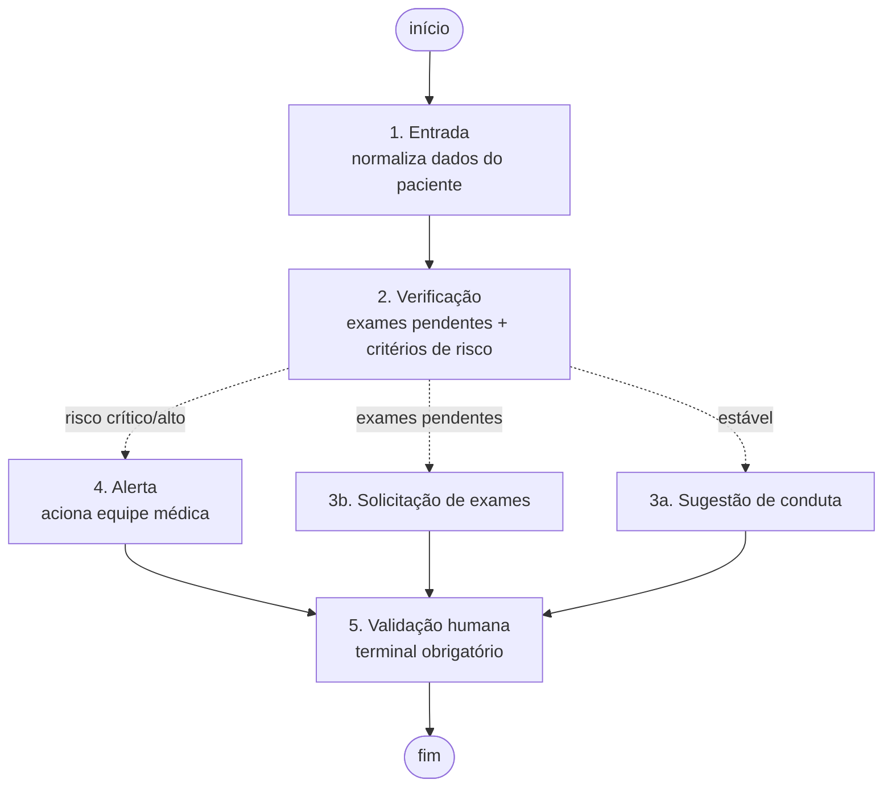

# Relatório Técnico — Assistente Virtual Médico

**Tech Challenge Fase 3 — FIAP 9IADT**
Fine-tuning de LLM + LangChain + LangGraph

---

## 1. Visão geral

Este projeto implementa um assistente virtual de apoio à decisão clínica para
uso interno de um hospital. O assistente responde dúvidas de profissionais de
saúde combinando três fontes: os **protocolos internos** da instituição
(recuperados por RAG), os **dados atualizados do paciente** (consultados em
uma base estruturada) e um **modelo de linguagem ajustado** por fine-tuning
sobre o vocabulário e o formato de resposta da instituição.

O fluxo de atendimento é orquestrado por um **grafo de decisão** que roteia o
caso conforme o estado clínico do paciente, e todo o sistema opera sob
guardrails que garantem que o assistente nunca prescreve e que toda saída
exige validação humana.

> Todos os dados são sintéticos. Os protocolos foram escritos para fins
> didáticos e não constituem orientação clínica real.

---

## 2. Preparação dos dados

### 2.1 Origem

Optamos por **gerar dados sintéticos** em vez de usar PubMedQA ou MedQuAD.
A razão é que o enunciado pede um assistente treinado com "dados internos do
hospital" — protocolos institucionais, perguntas frequentes de médicos,
modelos de laudo. PubMedQA é literatura científica, não conhecimento
institucional; um modelo ajustado nele responderia como um artigo, não como o
protocolo da casa. A geração sintética também permite demonstrar o pipeline
de anonimização de forma verificável, já que conhecemos o valor original de
cada dado identificável.

O corpus base são **10 protocolos clínicos internos** cobrindo 8
especialidades (cardiologia, endocrinologia, pneumologia, neurologia,
infectologia, pediatria, ginecologia e ortopedia), definidos em
`preprocessing/protocols_bank.py`. A partir deles são gerados:

- **120 pares instrução/resposta** simulando perguntas frequentes de médicos;
- **80 registros hospitalares** com dados identificáveis (nome, CPF, RG,
  telefone, endereço, data de nascimento, número de prontuário) para
  exercitar a anonimização.

### 2.2 Preprocessing

`preprocessing/clean.py` aplica:

- **Normalização de encoding** (NFC), evitando que a mesma palavra acentuada
  apareça em duas formas Unicode distintas e vire dois tokens diferentes.
- **Remoção de ruído** típico de fontes internas: marcadores de OCR,
  `<<confidencial>>`, sequências de asteriscos, caracteres de largura zero.
- **Deduplicação** por hash SHA-256 do conteúdo normalizado.

**Resultado:** 28 dos 120 pares eram duplicatas (23%) e foram removidos,
restando 92. A taxa alta é esperada: os templates de pergunta se repetem
entre protocolos da mesma especialidade.

### 2.3 Anonimização

`preprocessing/anonymize.py` usa duas estratégias combinadas:

1. **Campos rotulados** (`Paciente:`, `CPF:`, `RG:`, `Telefone:`, ...) — o
   sinal mais confiável em registros semiestruturados.
2. **Regexes de forma** para PII em texto livre, sem rótulo antes.

A ordem importa: os campos rotulados são processados primeiro. Descobrimos
isso na prática — o RG gerado pelo Faker aparece tanto como `31806425X` quanto
como `784125600`, e nenhum regex de forma razoável cobre as duas variações sem
capturar falsos positivos. O rótulo resolve o caso com precisão.

Há ainda uma **camada opcional de NER** via spaCy (`--use-ner`), que captura
nomes de pessoa fora de campos rotulados. É opcional por design: exige
download de modelo, e o pipeline precisa funcionar sem rede.

**Validação:** como os dados são sintéticos, conhecemos o valor original de
cada PII e podemos medir o recall da anonimização diretamente.

| Métrica | Resultado |
|---|---|
| Valores de PII verificados | 560 |
| Valores vazados após anonimização | **0** |
| Recall da anonimização | **100%** |

Na primeira execução o recall foi de 85,2% (62 vazamentos), justamente por
causa dos formatos de RG e telefone não cobertos. A adição da camada de
campos rotulados levou o recall a 100%.

### 2.4 Curadoria

Critérios documentados em `data/processed/curation_report.md`, regenerado a
cada execução:

| Critério | Valor | Justificativa |
|---|---|---|
| Mínimo de tokens na resposta | 15 | Descarta respostas incompletas. |
| Máximo de tokens (instrução + resposta) | 800 | Mantém o custo de fine-tuning previsível. |
| Balanceamento por especialidade | máx. 1,5× a menor | Evita que cardiologia domine o treino. |
| Split | 80/10/10 estratificado | Validação e teste representam todas as especialidades. |

O balanceamento importou: cardiologia tinha 21 exemplos contra 7 de
endocrinologia. Sem undersampling, o modelo veria três vezes mais cardiologia
e tenderia a responder em termos cardiológicos mesmo para perguntas de outras
áreas.

**Splits finais:** 59 treino / 8 validação / 8 teste.

Este é um dataset pequeno, o que é uma limitação real e assumida — ver
[§8](#8-limitações).

---

## 3. Fine-tuning

### 3.1 Escolha do modelo base

**TinyLlama-1.1B-Chat-v1.0**, entre as opções sugeridas no enunciado. O
critério foi caber no hardware realisticamente disponível: treina com QLoRA em
uma GPU T4 (Colab gratuito), enquanto LLaMA 3 8B ou Mistral 7B exigiriam
quantização mais agressiva ou GPU paga. O modelo é trocável por linha de
comando (`--base-model`), então subir para um modelo maior não exige mudança
de código.

### 3.2 Técnica

**QLoRA** — LoRA sobre um modelo quantizado em 4 bits (NF4, double
quantization), com a stack `transformers` + `peft` + `trl` (SFTTrainer) +
`bitsandbytes`. Isso viabiliza o treino em GPU única mantendo apenas os
adapters treináveis.

### 3.3 Hiperparâmetros

| Parâmetro | Valor |
|---|---|
| Learning rate | 2e-4 |
| Épocas | 12 |
| Batch size (por device) | 4 |
| Gradient accumulation | 1 (batch efetivo 4) |
| LoRA `r` | 16 |
| LoRA `alpha` | 32 |
| LoRA dropout | 0,05 |
| Módulos alvo | `q_proj`, `k_proj`, `v_proj`, `o_proj`, `gate_proj`, `up_proj`, `down_proj` |
| Max sequence length | 1024 |
| Quantização | 4-bit NF4 |

Todos são salvos junto dos adapters em `hyperparameters.json` ao final do
treino, junto das métricas de loss.

**Sobre o número de épocas.** A configuração inicial (3 épocas, batch efetivo
16) rendia apenas **~9 atualizações de peso** sobre os 59 exemplos de treino.
Com tão poucos passos os adapters LoRA praticamente não saem da
inicialização, e a comparação antes/depois — que é justamente o que o
enunciado cobra — não mostraria diferença alguma. Reduzir a acumulação de
gradiente para 1 e subir para 12 épocas dá **~168 atualizações**, mantendo o
treino em poucos minutos numa T4. O script imprime esse plano antes de
começar e emite aviso se o total cair abaixo de 50 passos.

### 3.3.1 Robustez a versões de biblioteca

O treino roda em Colab/Kaggle, onde as versões de `trl` e `transformers`
mudam sem aviso. Isso não é hipotético: a primeira execução real falhou com
`TypeError: SFTConfig.__init__() got an unexpected keyword argument
'max_seq_length'` — o parâmetro foi renomeado para `max_length` — **depois**
de já ter baixado 2,2 GB de pesos.

`resolve_config_kwargs` passou a traduzir esses nomes em runtime,
inspecionando o que a versão instalada aceita:

| Nome canônico | Alternativa | Onde mudou |
|---|---|---|
| `max_length` | `max_seq_length` | trl < 0.20 |
| `warmup_ratio` | `warmup_steps` | transformers 5.x |
| `eval_strategy` | `evaluation_strategy` | transformers < 4.41 |
| `dtype` | `torch_dtype` | transformers 5.0 |

O caso do `dtype` é o mais traiçoeiro: como `from_pretrained` recebe
`**kwargs`, o nome errado não levanta erro — apenas é ignorado, e o modelo
carrega em fp32 silenciosamente. Por isso ali a escolha é feita pelo número
de versão. `tests/test_finetuning_compat.py` cobre as duas convenções.

### 3.4 Contrato de prompt

`finetuning/config.py` define `SYSTEM_PROMPT` e `format_prompt()`, usados
**tanto no treino quanto na inferência**. Isso é o ponto de integração entre
as duas frentes do projeto: o assistente (Etapa 3) importa as mesmas funções,
garantindo que o modelo receba na produção exatamente o formato em que foi
treinado. Uma divergência aqui degradaria o modelo silenciosamente.

```
<|system|>
{system_prompt}
<|user|>
{instruction}
<|assistant|>
{output}
<|end|>
```

### 3.5 Estado da execução

⚠️ **O treino não foi executado neste repositório.** O ambiente de
desenvolvimento não possui GPU nem acesso à Hugging Face Hub (política de
rede restrita). O código de treino e avaliação está completo e pronto para
rodar no Colab/Kaggle — há um notebook em
`finetuning/notebooks/colab_finetune.ipynb`.

Para que a lógica testável não ficasse refém disso, os imports pesados são
**lazy**: `finetuning/config.py` e `finetuning/dataset.py` (contrato de prompt
e carregamento do dataset) são importáveis e testados sem `torch`. Há também
um modo `--smoke-test` que valida mecanicamente a pipeline (tokenização →
LoRA → SFTTrainer → salvamento) com um GPT-2 minúsculo inicializado
aleatoriamente, sem nenhum download.

### 3.6 Avaliação planejada

`finetuning/evaluate.py` produz, sobre `data/processed/test.jsonl`:

- **Perplexidade** do modelo base vs. fine-tuned;
- **ROUGE-1 / ROUGE-L** das respostas geradas contra a referência;
- **Comparação qualitativa lado a lado** (pergunta, referência, resposta base,
  resposta fine-tuned).

Saída em `finetuning/eval_results/evaluation_report.md`.

> **A preencher após a execução no Colab:**
>
> | Métrica | Base | Fine-tuned |
> |---|---|---|
> | Perplexidade | — | — |
> | ROUGE-1 | — | — |
> | ROUGE-L | — | — |

---

## 4. O assistente médico

### 4.1 Componentes

| Camada | Implementação | Decisão relevante |
|---|---|---|
| LLM | `assistant/llm.py` | Backend plugável: `finetuned`, `base` ou `template`. |
| Base estruturada | `assistant/database.py` | SQLite com prontuários, exames e evoluções. |
| RAG | `assistant/rag.py` | FAISS sobre os protocolos, embeddings TF-IDF. |
| Orquestração | `assistant/chains.py` | Amarra guardrails, contexto, LLM, explainability e auditoria. |

### 4.2 Consulta à base estruturada: tools, não SQL Agent

O enunciado sugere "SQL Chain/Agent ou tools customizadas". Escolhemos
**funções tipadas com SQL parametrizado** (`get_patient_record`,
`get_pending_exams`).

O motivo é de segurança: um SQL Agent deixa o LLM escrever consultas
arbitrárias sobre uma base de prontuários. Isso abre superfície para injeção e
para leitura de registros de outros pacientes — um risco desnecessário, já que
o conjunto de consultas que o fluxo precisa é pequeno e perfeitamente
conhecido de antemão. Flexibilidade que não é necessária, em dados de saúde,
é só risco.

### 4.3 RAG: três decisões que mudaram o resultado

**(a) A especialidade acrescenta contexto, não restringe.**

A implementação inicial filtrava a busca pela especialidade do paciente. Ao
testar o caso do `PAC-0003` — pneumonia evoluindo com sepse — o protocolo de
sepse (`PROT-INF-001`, infectologia) simplesmente não era recuperado, porque
o paciente está catalogado em pneumologia.

Isso é uma falha clínica séria: quadros graves atravessam especialidades.
Invertemos a lógica — a busca é global, e a especialidade do paciente só
*anexa* seu melhor trecho se ele não veio naturalmente. Deixar de recuperar um
protocolo crítico é muito mais caro que recuperar um protocolo a mais.

**(b) Chunks indexados com cabeçalho de contexto.**

Cada trecho é embeddado junto de título, condições e especialidade do
protocolo. Sem isso, um chunk que menciona apenas "escore CURB-65" não casa
com uma pergunta sobre "pneumonia" — a palavra não aparece naquele trecho. O
cabeçalho devolve ao chunk o contexto que o split removeu. O texto exibido ao
usuário continua sendo só o corpo do protocolo.

**(c) Stopwords em português.**

O scikit-learn só embute lista de stopwords para inglês. Sem elas, termos como
"de", "para" e "que" dominavam os vetores TF-IDF e achatavam a discriminação.

Efeito medido das duas últimas decisões, no benchmark de 15 perguntas:

| Configuração | Top-1 | Recall@3 |
|---|---|---|
| Baseline | 73,3% | 93,3% |
| + stopwords PT | 80,0% | 93,3% |
| + cabeçalho nos chunks | 80,0% | 100% |
| **Ambos** | **93,3%** | **100%** |

O split em chunks também foi escolhido pela estrutura do documento: os
protocolos são listas numeradas de condutas, então quebramos nos itens em vez
de cortar por número de caracteres — o que partiria uma conduta ao meio e
produziria contexto truncado no prompt.

### 4.4 Embeddings

Padrão: **TF-IDF** ajustado sobre o próprio corpus. Determinístico, sem GPU e
sem download — o RAG roda e é testável offline, o que era requisito do
ambiente. Para um corpus pequeno de vocabulário técnico muito específico
(siglas clínicas, identificadores de protocolo), TF-IDF recupera bem, como os
números acima mostram.

`load_huggingface_embeddings()` oferece embeddings densos para produção, onde
similaridade semântica além da lexical importa mais.

---

## 5. Fluxo automatizado com LangGraph

### 5.1 O grafo



O diagrama gerado automaticamente pelo LangGraph está em
`docs/fluxo_langgraph.mmd`.

### 5.2 Roteamento condicional

`route_after_verification` decide o caminho em ordem de precedência:

1. **Risco crítico ou alto → `alerta`**
2. **Exames pendentes → `solicitacao_exames`**
3. **Caso contrário → `sugestao`**

A precedência do alerta sobre os exames pendentes é uma decisão deliberada:
um paciente com critérios de sepse não pode esperar o resultado de um exame
para que a equipe seja acionada. Está travada pelo teste
`test_route_prioritizes_alert_over_pending_exams`.

Todos os caminhos convergem para `validacao_humana`, que é terminal — nenhum
fluxo se encerra sem marcar que a revisão de um profissional é obrigatória.

### 5.3 Detecção de risco: determinística, fora do LLM

`graphs/risk.py` extrai sinais vitais do prontuário (PA, FC, FR, SpO2,
temperatura, lactato) e aplica os limiares que os próprios protocolos
internos definem.

Esse módulo é **independente do LLM** por decisão de projeto: a decisão de
acionar a equipe médica não pode depender de o modelo ter gerado o texto
certo. O LLM compõe a explicação; quem decide se há risco é código
determinístico e testável.

| Nível | Critério |
|---|---|
| `critico` | qSOFA ≥ 2, lactato ≥ 4 mmol/L, ou condição de tempo crítico (sepse, AVC, cauda equina) |
| `alto` | qSOFA = 1 ou SpO2 < 92% |
| `moderado` | Qualquer critério isolado |
| `baixo` | Nenhum critério |

Um detalhe de implementação que só apareceu ao testar: o lactato precisa ser
buscado **por linha**, não por proximidade de caracteres. No prontuário a
linha do exame traz uma data entre o nome e o resultado
(`Lactato sérico: CONCLUÍDO em 2026-08-18 — resultado: 4,2 mmol/L`), e um
regex baseado em distância falhava silenciosamente.

### 5.4 Caminhos demonstrados

| Paciente | Situação | Caminho | Risco |
|---|---|---|---|
| `PAC-0001` | Hipertenso estável | `entrada → verificacao → sugestao → validacao_humana` | baixo |
| `PAC-0002` | HbA1c pendente | `entrada → verificacao → solicitacao_exames → validacao_humana` | baixo |
| `PAC-0003` | Sepse de foco pulmonar | `entrada → verificacao → alerta → validacao_humana` | **crítico** |

No caso do `PAC-0003`, o sistema detecta 7 critérios de risco simultâneos
(qSOFA 3, hipoxemia, lactato 4,2, febre, sepse registrada) e recupera
corretamente o `PROT-INF-001`.

---

## 6. Segurança, validação e explainability

### 6.1 Guardrails em duas camadas

| Camada | Onde | Natureza |
|---|---|---|
| Prompt de sistema | `finetuning/config.py` | Instrução ao modelo |
| Validação programática | `security/guardrails.py` | Determinística, sempre executada |

A segunda camada existe porque **instrução em prompt não é controle de
segurança**: o modelo pode ignorá-la, e o comportamento muda a cada
fine-tuning. Em contexto clínico, a garantia de que o assistente nunca
prescreve não pode depender de o modelo ter obedecido.

| Controle | Momento | Ação |
|---|---|---|
| `check_input_scope` | pré-LLM | Bloqueia fora de escopo, pedido de prescrição, prompt injection. |
| `check_output_safety` | pós-LLM | Bloqueia prescrição direta na resposta. |
| `enforce_human_validation` | pós-LLM | Anexa o aviso de validação obrigatória. |

**Onde traçamos a linha da "prescrição direta":** só bloqueamos quando há
posologia numérica *combinada* com verbo imperativo de administração
("Administre 500 mg de..."). Citar o que o protocolo recomenda ("a primeira
linha é metformina, a critério médico") ou mencionar um valor de referência
diagnóstico ("glicemia ≥ 126 mg/dL") é legítimo. Um guardrail que barrasse
esses casos tornaria o assistente inútil para o profissional — ambos estão
cobertos por testes que garantem que continuam passando.

### 6.2 Logging de auditoria

Formato JSON Lines em `logs/audit.jsonl`, diretamente consultável com `jq` ou
pandas. Cada interação registra: `timestamp`, `session_id`, `pergunta`,
`contexto_recuperado` (com scores), `contexto_paciente`, `resposta`, `fontes`,
`confianca`, `grafo_nos_executados`, `bloqueios_seguranca`, `alerta_emitido`,
`requer_validacao_humana`, `llm_backend`, `duracao_ms`.

`security/inspect_logs.py` resume e filtra esse log (por bloqueios, alertas,
sessão ou caminho no grafo).

Rastreabilidade externa via **LangSmith** funciona automaticamente se as
variáveis de ambiente estiverem definidas, mas o log local é a fonte de
auditoria própria da instituição — rastreabilidade em saúde não deve depender
de um serviço externo.

### 6.3 Explainability

Toda resposta carrega um bloco com:

- **Fontes** — protocolos (identificador, título, relevância) e registro de
  prontuário que embasaram a conduta;
- **Grau de confiança** — derivado da similaridade dos trechos recuperados
  (peso 0,7), da presença de dados do paciente (peso 0,3) e de uma penalidade
  de 25% quando há exames pendentes.

O score é de **recuperação, não de correção clínica** — mede o quanto o
assistente encontrou base documental e contexto para responder. Essa distinção
é escrita junto ao número na própria resposta, para não induzir o
profissional a lê-lo como aval clínico.

---

## 7. Testes

**123 testes** (`pytest -q`), distribuídos por camada:

| Arquivo | Cobre |
|---|---|
| `test_preprocessing.py` | Anonimização, limpeza, deduplicação, curadoria, splits. |
| `test_finetuning.py` | Contrato de prompt e carregamento do dataset. |
| `test_finetuning_compat.py` | Tradução de nomes de parâmetro entre versões de `trl`/`transformers`. |
| `test_database.py` | Base estruturada, exames pendentes, idempotência do seed. |
| `test_assistant.py` | RAG, benchmark de recuperação, explainability, chain, auditoria. |
| `test_guardrails.py` | Bloqueios e — igualmente importante — casos legítimos que **não** devem ser bloqueados. |
| `test_graph.py` | Sinais vitais, classificação de risco, roteamento, os três caminhos ponta a ponta. |
| `test_audit.py` | Schema do log, unicidade de sessão, handlers não duplicados. |

O teste `test_retrieval_benchmark_meets_quality_bar` trava os patamares de
recuperação (top-1 ≥ 80%, recall@3 ≥ 90%), então uma regressão no RAG quebra o
build em vez de degradar silenciosamente.

---

## 8. Limitações

1. **O fine-tuning não foi executado.** Ambiente sem GPU e sem acesso à
   Hugging Face Hub. O código está completo e pronto para o Colab; as métricas
   do modelo em [§3.6](#36-avaliação-planejada) só ficam preenchidas após essa
   execução. Esta é a lacuna mais relevante do trabalho.
2. **Dataset pequeno** (59 exemplos de treino). Suficiente para o modelo
   aprender o *formato* de resposta institucional, mas não para adquirir
   conhecimento clínico novo. Aumentar exigiria mais protocolos ou mais
   variação de templates.
3. **Embeddings lexicais.** TF-IDF não captura sinonímia ("dispneia" vs.
   "falta de ar"). Embeddings densos resolveriam, ao custo da dependência de
   rede.
4. **Detecção de risco por regex.** Funciona sobre o formato estruturado do
   prontuário sintético; prontuários reais, com texto livre e abreviações
   variadas, exigiriam NER clínico.
5. **Guardrails baseados em padrões.** Cobrem os vetores testados, mas
   listas de padrões são inerentemente incompletas. Em produção, valeria
   somar um classificador de escopo e revisão periódica dos logs de bloqueio.
6. **Protocolos sintéticos.** Não refletem diretrizes reais; os limiares de
   risco replicam apenas esses protocolos.

---

## 9. Reprodução

```bash
pip install -r requirements.txt

python -m preprocessing.run_pipeline   # Etapa 1: dados
python -m assistant.database           # Etapa 3: base estruturada
python -m assistant.evaluate_rag       # avaliação do RAG
python -m graphs.cli --demo            # Etapa 4: os três caminhos
python -m security.inspect_logs        # Etapa 5: auditoria
pytest -q                              # suíte completa
```

O fine-tuning (Etapa 2) roda no Colab — ver `finetuning/README.md`.
