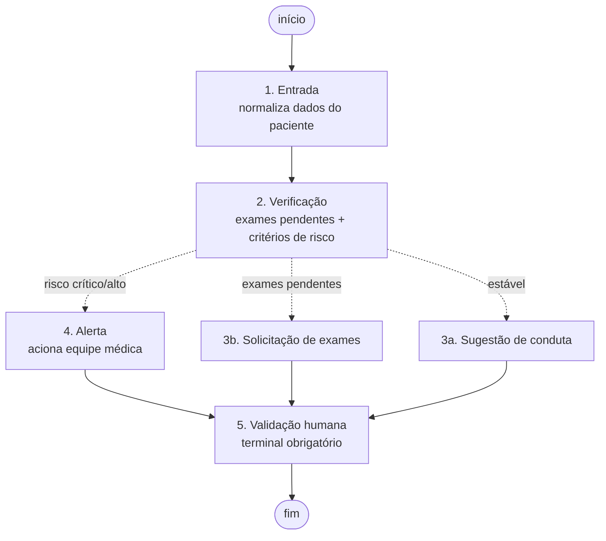

# graphs/

Implementa a Etapa 4 do Tech Challenge: fluxos automatizados com LangGraph.

| Módulo | Responsabilidade |
|---|---|
| `state.py` | `ClinicalState` — estado compartilhado entre os nós. |
| `risk.py` | Extração de sinais vitais e classificação de risco clínico. |
| `clinical_flow.py` | Grafo de decisão (5 nós + arestas condicionais). |
| `cli.py` | Execução e demonstração do fluxo. |

## O grafo



O diagrama gerado automaticamente pelo LangGraph está em
`docs/fluxo_langgraph.mmd` (`python -m graphs.cli --diagrama`).

## Roteamento condicional

`route_after_verification` decide o caminho, em ordem de precedência:

1. **Risco crítico ou alto → `alerta`.** Precede tudo, inclusive exames
   pendentes: um paciente com critérios de sepse não pode esperar a chegada
   de um exame para que a equipe seja acionada. Essa precedência é coberta
   pelo teste `test_route_prioritizes_alert_over_pending_exams`.
2. **Exames pendentes → `solicitacao_exames`.** É o desvio pedido
   explicitamente no enunciado: sem os exames, o fluxo solicita em vez de
   sugerir tratamento.
3. **Caso contrário → `sugestao`**, a conduta baseada nos protocolos.

Todos os caminhos convergem para `validacao_humana`, que é terminal: nenhum
fluxo se encerra sem marcar que a revisão de um profissional é obrigatória.

## Critérios de risco (`risk.py`)

A classificação é **determinística e independente do LLM** — a decisão de
acionar a equipe médica não deve depender de o modelo ter gerado o texto
certo. O módulo extrai sinais vitais do prontuário (PA, FC, FR, SpO2,
temperatura, lactato) e aplica os limiares que os próprios protocolos
internos definem:

| Nível | Critério |
|---|---|
| `critico` | qSOFA ≥ 2, lactato ≥ 4 mmol/L, ou condição de tempo crítico (sepse, AVC, cauda equina) |
| `alto` | qSOFA = 1 ou SpO2 < 92% |
| `moderado` | Qualquer outro critério isolado (ex.: febre alta) |
| `baixo` | Nenhum critério |

Os limiares replicam os protocolos sintéticos deste projeto e não constituem
referência clínica real.

## Uso

```bash
# Demonstra os três caminhos em sequência (ideal para o vídeo)
python -m graphs.cli --demo

# Um caso específico
python -m graphs.cli --paciente PAC-0003 --pergunta "Qual a conduta?"

# Exporta o diagrama do grafo
python -m graphs.cli --diagrama docs/fluxo_langgraph.mmd
```

### Pacientes de demonstração

| Paciente | Situação | Caminho no grafo |
|---|---|---|
| `PAC-0001` | Hipertenso estável, exames concluídos | `entrada → verificacao → sugestao → validacao_humana` |
| `PAC-0002` | Diabético com HbA1c pendente | `entrada → verificacao → solicitacao_exames → validacao_humana` |
| `PAC-0003` | Pneumonia evoluindo com sepse | `entrada → verificacao → alerta → validacao_humana` |
| `PAC-0004` | Gestante com TOTG pendente | `entrada → verificacao → solicitacao_exames → validacao_humana` |
| `PAC-0005` | Lombalgia sem red flags | `entrada → verificacao → sugestao → validacao_humana` |

## Auditoria

Cada execução do grafo grava em `logs/audit.jsonl` uma entrada consolidada
com o caminho percorrido (`grafo_nos_executados`), além das entradas que a
chain já registra por chamada à LLM.
